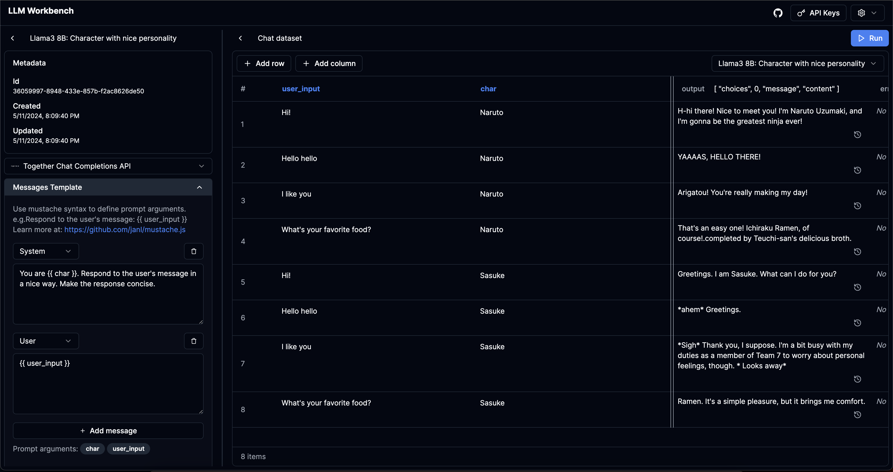

# LLM Workbench

https://www.llmwb.com/

Supercharged workbench for LLMs. Test prompt templates from different models and providers with datasets of prompt arguments to replace the placeholders.



## Problem

I've built three different AI chatbots now. In the process, I've had to shoddily build subsets of the features supported by this application. I've also wanted to have a no-code platform to test prompts for various arguments to see how the prompt works.

I personally don't find the auto prompt-writer libraries that appealing - I want to get a decent enough vibe-check across a variety of parameters.

I also personally don't use any of the abstraction libraries and don't find them that useful. However, there seemed little tooling for people who want to raw-dog test prompts.

I was inspired by Anthropic's recent workbench platform seemed like a good step-up from OpenAI's Playground.

The application solves these specific user problems:

- For a specific llm prompt that takes `args: Record<string, string>` as its prompt parameters, I want to be able to test different model parameters.
- For a specific llm propmt, I want to test out different sets of prompt parameters, maybe happy case, or cases that I've seen fail somehow.
- For a specific set of prompt parameters, I want to test out different llm prompts to do a vibe-check on their outputs.
- (Providers seem to have different default parameters especially for open source models) I want to test the same prompt + model for different providers to understand their behavior
- I want to view the history of multiple runs for a specific set of parameter that I've provided. 

## Features

1. Create "templates": messages / raw prompts that use `{{ }}` for denoting variables using Mustache.js.
2. Create "datasets": Create a list of variables that you want to test the templates on.
3. Support all parameters: Be able to input all the parameters available for different APIs as well as on the UI. I've found that a lot of semi-professional playground tools do not support parameters like tools or logit_bias. The project is built to be able to easily extend new parameters when they are added by providers.
4. Support all meaningful providers in the ecosystem:

- [x] OpenAI
- [ ] Anthropic
- [ ] Gemini
- [x] Together
- [ ] AWS Bedrock
- [ ] Azure
- [ ] Anyscale
- [ ] Groq
- [ ] Openrouter
- [ ] User-defined APIs

## Todo
1. Manual input of prompt arguments as JSON
2. Import CSV 
3. Version control prompts and datasets
4. Custom providers and custom models 
5. Multi-modal input + parameters
6. Toggle visible columns + show compiled inputs

## Security
**The templates / datasets / API keys that you add on the website are only stored locally on your browser.**


## Running locally

LLM Workbench as of now is just a Next.js App. Assuming you have yarn, you can run with the following:

```
yarn
yarn dev
```
